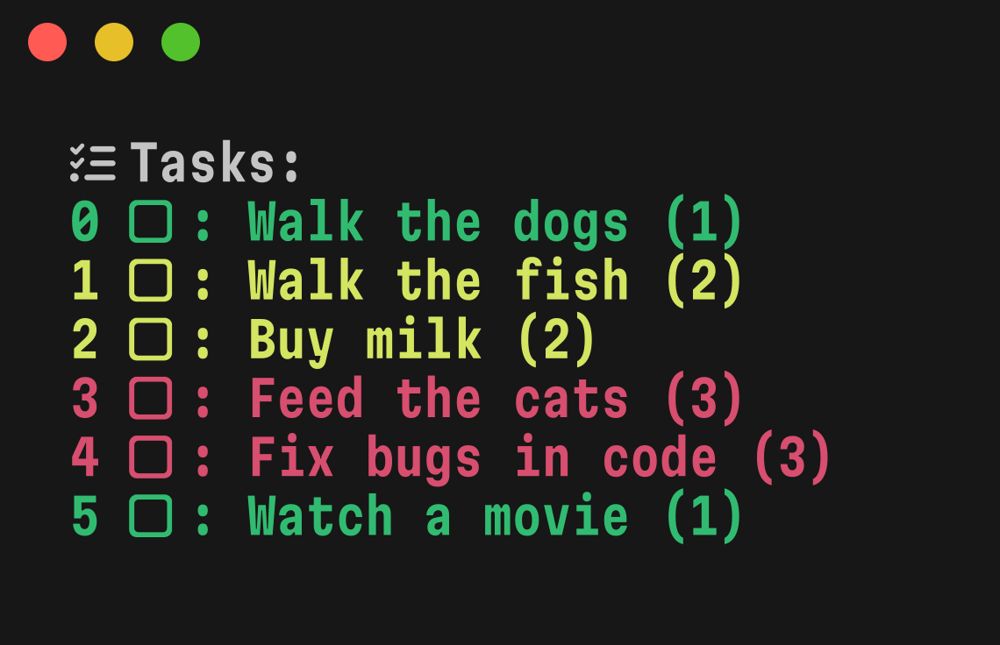

# Recall



[](https://deepwiki.com/indium114/recall)

**recall** is a minimal to-do list/reminders tool for the CLI!

## Installation

The official installation method is using **homebrew**.

To install, run this command:

```bash
brew install indium114/formulae/recall
```
